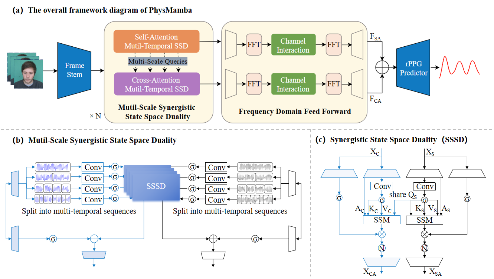

# PhysMamba

## :wrench: Setup

STEP1: `bash setup1.sh` 

STEP2: `conda activate rppg-toolbox` 

STEP3: `bash setup2.sh` 

The codes are based on [rPPG-toolbox](https://github.com/ubicomplab/rPPG-Toolbox)

## :computer: Examples of Neural Network Training

Please use config files under `./configs/train_configs`

### Intra-dataset on MMPD With PhysMamba

STEP 1: Download the MMPD raw data by asking the paper authors

STEP 2: Modify `./configs/train_configs/intra/0MMPD_PhysMamba.yaml` 

STEP 3: Run `python main.py --config_file ./configs/train_configs/intra/0MMPD_PhysMamba.yaml` 

### Intra-dataset on UBFC With PhysMamba

STEP 1: Download the UBFC raw data by asking the paper authors

STEP 2: Modify `./configs/train_configs/intra/0UBFC_PhysMamba.yaml` 

STEP 3: Run `python main.py --config_file ./configs/train_configs/intra/0UBFC_PhysMamba.yaml` 

### Intra-dataset on PURE With PhysMamba

STEP 1: Download the PURE raw data by asking the paper authors

STEP 2: Modify `./configs/train_configs/intra/0PURE_PhysMamba.yaml` 

STEP 3: Run `python main.py --config_file ./configs/train_configs/intra/0PURE_PhysMamba.yaml` 

### Cross-dataset - Training on MMPD and testing on PURE With PhysMamba

STEP 1: Download the PURE raw data by asking the paper authors

STEP 2: Download the MMPD raw data by asking the paper authors

STEP 3: Modify `./configs/train_configs/cross/MMPD_PURE_PhysMamba.yaml` 

STEP 4: Run `python main.py --config_file ./configs/train_configs/cross/MMPD_PURE_PhysMamba.yaml` 

### Cross-dataset - Training on PURE and testing on MMPD With PhysMamba

STEP 1: Download the PURE raw data by asking the paper authors

STEP 2: Download the MMPD raw data by asking the paper authors

STEP 3: Modify `./configs/train_configs/cross/PURE_MMPD_PhysMamba.yaml` 

STEP 4: Run `python main.py --config_file ./configs/train_configs/cross/PURE_MMPD_PhysMamba.yaml` 

